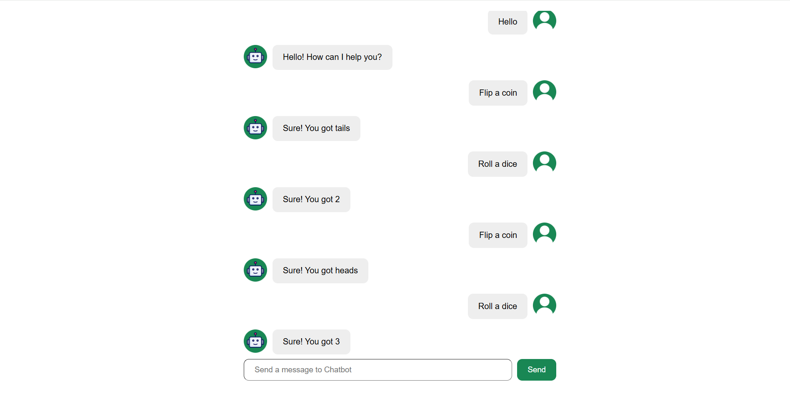

# 🤖 Chatbot with React

An interactive chatbot application built using **React** and **Vite**.  
The chatbot allows users to send messages and get automated responses powered by an **external API**.



---

## ✨ Features
- 🗨️ Real-time chat interface with user and bot messages.
- 🤖 Bot responses generated via API (`supersimpledev` package).
- ⏳ Loading indicator while waiting for bot response.
- 🎨 Simple and clean UI with custom styles.
- 🔄 Auto-scroll to the latest message.

---

## 🚀 Installation & Setup

Clone the repository:
```bash
git clone https://github.com/BlagaRa/Chatbot-with-React.git
cd Chatbot-with-React
